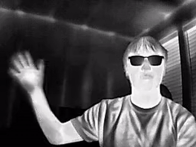
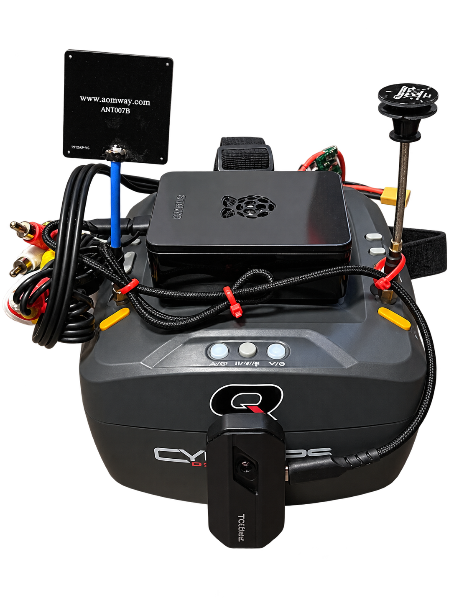
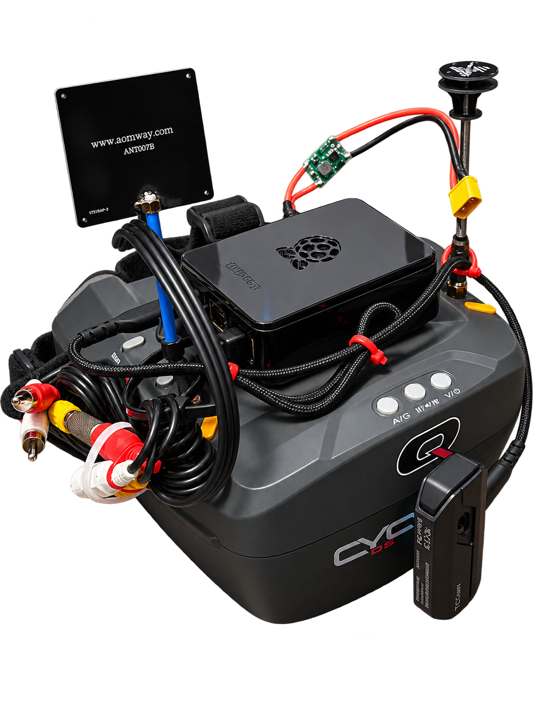

<p align="center">
  
</p>

# TC001 Thermal Goggles

Head-mounted thermal vision built from a Raspberry Pi 4, a TOPDON TC001 USB thermal camera, and a pair of analog FPV goggles.

The TC001 is designed to plug into a phone. I wanted to know whether it could instead drive a pair of FPV goggles and behave like an appliance: apply power, put the headset on, see heat. It can. Along the way the build turned into something a bit more general: the Pi sits between the sensor and the display, so the image pipeline can be changed in software without touching any of the hardware.

## What it does

- Pulls the TC001's 256x192 thermal stream over USB at 25 fps using V4L2 and OpenCV.
- Renders a white-hot image tuned for *seeing* rather than measuring: local contrast enhancement (CLAHE) and light sharpening, no temperature readouts or HUD.
- Sends NTSC composite video out of the Pi's 3.5 mm A/V jack into the goggles' AV input.
- Boots directly into the viewer. No keyboard, mouse, or desktop, and the viewer restarts itself if it exits.
- Keeps the goggles' normal FPV receiver working. The headset's RX/AV switch flips between the drone feed and the thermal feed.
- Runs off a 2S LiPo through an adjustable buck converter.
- Leaves SSH untouched so I can still work on the Pi while the console is dedicated to the display.

## Signal chain

```text
TOPDON TC001
     │ USB (256x384 YUYV, image + radiometric halves)
     ▼
Raspberry Pi 4
     ├─ PyThermalCamera capture (patched)
     ├─ white-hot / CLAHE / unsharp mask
     ├─ OpenCV fullscreen window on X11 + Openbox
     └─ 720x480i NTSC composite out
              │
              ▼
        3.5 mm TRRS jack ──► yellow RCA ──► Cyclops AV IN
```

The goggles have two inputs: their built-in 5.8 GHz receiver and an external AV jack. The Pi drives the AV jack, so the existing input switch on the headset doubles as a mode switch between conventional FPV video and thermal. I tested this on the finished build and it works without any rewiring.

## Hardware

| Part | Role |
|---|---|
| Raspberry Pi 4 | Capture, processing, composite video output |
| TOPDON TC001 | 256x192 LWIR thermal camera, USB-C, powered by the Pi |
| Quanum Cyclops Diversity DVR goggles | Display, plus the stock FPV receiver |
| Pi-compatible TRRS-to-RCA cable | Composite video to the goggles |
| 2S LiPo + MP1584EN buck module | Portable power, set to ~5.1 V |

Full part list in [`docs/BOM.md`](docs/BOM.md). Wiring, pinout, and power setup in [`docs/HARDWARE.md`](docs/HARDWARE.md).

<p>


</p>

The two views are my photos of the finished build with the background removed. The hardware is as built; do not rely on any fine label text in them.

## Software

The viewer is Les Wright's [PyThermalCamera](https://github.com/leswright1977/PyThermalCamera) with a set of patches applied at install time by [`scripts/patch_tc001.py`](scripts/patch_tc001.py). I went with a patcher instead of a fork so upstream credit and license stay with the original file and updates are easy to pull in.

The patches:

1. Start fullscreen with the HUD, center temperature, and min/max markers turned off. The crosshair stays.
2. Widen the radiometric half of the frame to `int32` before the `* 256` math. Newer NumPy raises `OverflowError` on the upstream `uint8` version.
3. Add a white-hot mode (11) and black-hot mode (12) that run CLAHE (`clipLimit=2.0`, 8x8 tiles) followed by a mild unsharp mask, and make white-hot the default.
4. Extend the colormap cycling so the original palettes are still reachable from the `m` key.

On the system side the installer enables composite output in `config.txt`, writes a `.xinitrc` that launches Openbox, hides the cursor with `unclutter`, and loops the viewer, and adds a guarded `startx` to `.bash_profile` that only fires on `tty1`. Details in [`docs/SOFTWARE.md`](docs/SOFTWARE.md), image tuning in [`docs/TUNING.md`](docs/TUNING.md).

## Install

On a fresh Raspberry Pi OS (tested on Debian Trixie):

```bash
git clone https://github.com/stekimboy/pi-thermal-goggles.git
cd pi-thermal-goggles
sudo ./install.sh
sudo reboot
```

The installer backs up `config.txt` and any existing `.xinitrc` before changing them. `sudo ./uninstall.sh` restores both and removes the autostart hook.

After reboot, from SSH:

```bash
./scripts/verify.sh
```

which checks for the viewer process, `/dev/video0`, the `Composite-1` output in `xrandr`, `unclutter`, and the TC001 USB ID (`0bda:5830`). A healthy system reports:

```text
Composite-1 ... 720x480
   720x480i      59.94*+
```

## Things that bit me

The problems that were not obvious going in, in case they save someone else some time:

- **No picture with a working composite output.** The Pi 4's A/V jack puts video on the *sleeve*, not the tip. Most generic TRRS-to-RCA cables (camcorder style) use a different mapping and silently give you nothing. A multimeter sorts this out quickly once you know to check.
- **`OverflowError: Python integer 256 out of bounds for uint8`.** Upstream multiplies the high byte by 256 while it is still `uint8`. Older NumPy wrapped silently; current NumPy refuses. The fix is one `astype(np.int32)` right after the frame split.
- **Faces turning into white blobs.** Raising OpenCV's global `alpha` for more contrast just clips every warm pixel to 255 and destroys the detail you wanted. CLAHE gives local contrast without blowing out the whole warm region. Global gain stays at 1.0.
- **`qt.qpa.xcb: could not connect to display`.** Launching the viewer from SSH for testing. SSH sessions don't own the local X display; use `DISPLAY=:0` or just check the auto-started instance with `pgrep -af tc001-goggles`.
- **Enabling composite kills HDMI.** Everything after that is done over SSH, which is why the installer is careful not to touch the SSH path.
- **Power margin.** The MP1584EN is a 3 A-class regulator and the Pi 4 is specced for 5.1 V / 3 A with the camera drawing from its USB bus. It has been fine in practice, but it is close to the edge. A bigger 5 V / 4–5 A module is on the list for the next revision.

## Where this could go

Because the Pi is a programmable layer between sensor and display, most of the interesting next steps are software:

- replace the `/dev/video0` assumption with proper USB device discovery
- measure end-to-end latency and battery runtime properly
- GPIO buttons for palette / mode switching without a keyboard
- person or vehicle detection on the thermal frame
- a second RGB camera and thermal/RGB fusion
- telemetry or heading overlays for use on a drone or robot
- event-triggered recording

The target applications I had in mind are the usual ones for cheap thermal: night-time situational awareness, search and rescue, drone and robot payloads, and a test bed for trying computer-vision models on real thermal data. See [`docs/ARCHITECTURE.md`](docs/ARCHITECTURE.md) for how the pieces are meant to fit together.

## Limitations

- 256x192 at 25 Hz is what the sensor is. It is enough to navigate and spot people; it is not a FLIR.
- The TC001 runs a shutter calibration every so often and the image freezes for a moment.
- Glass is opaque at these wavelengths. You cannot see through windows.
- Composite output disables HDMI while enabled.
- The launcher assumes the camera is `/dev/video0`.
- This is a prototype on a headstrap, not a ruggedized product. Don't use it as your only way of seeing while operating anything.
- Nothing has been measured. There are no numbers here for glass-to-glass latency, displayed frame rate, battery runtime, or current draw. The 25 fps figure is the camera's V4L2 stream rate, not a measurement at the goggles.

## Repository layout

```text
.
├── assets/                 thermal capture (GIF and a frame) and two build photos
├── docs/
│   ├── ARCHITECTURE.md     how the pieces fit and where it can grow
│   ├── BOM.md              parts list and power notes
│   ├── HARDWARE.md         wiring, pinout, composite mode, power setup
│   ├── SOFTWARE.md         boot path, patches, processing pipeline
│   ├── TUNING.md           white-hot / CLAHE tuning
│   └── TROUBLESHOOTING.md  common failures and how to check them
├── scripts/
│   ├── patch_tc001.py      builds tc001-goggles.py from upstream
│   └── verify.sh           post-reboot health check
├── install.sh
├── uninstall.sh
├── CONTRIBUTING.md
├── SECURITY.md
├── NOTICE
└── LICENSE
```

## Credits

The thermal capture and frame parsing come from [PyThermalCamera](https://github.com/leswright1977/PyThermalCamera) by Les Wright (Apache 2.0), which in turn builds on the TC001/P2Pro frame-format work by LeoDJ and the EEVblog forum. This repository adds the Raspberry Pi integration, composite video path, installer and patcher, the wearable display profile, and the documentation.

## License

Apache License 2.0. See [`LICENSE`](LICENSE) and [`NOTICE`](NOTICE).
